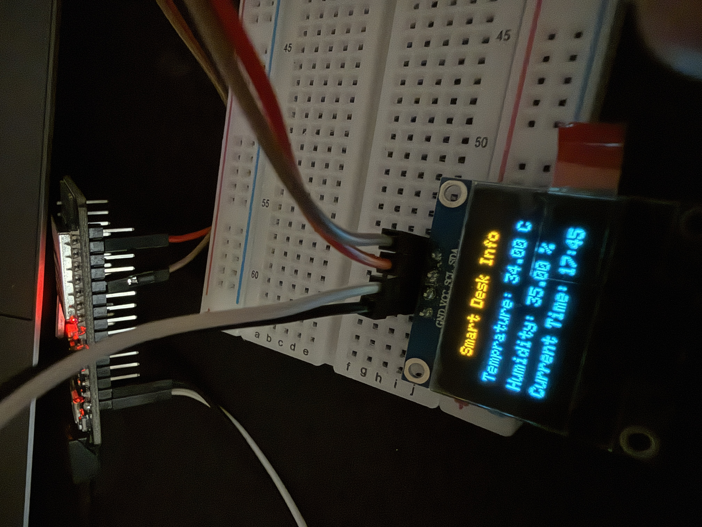

# Smart Desk Info Display (ESP32)

A small desk companion built on an ESP32 that shows live outdoor weather, your room's temperature and humidity, and the current date and time on an SSD1306 OLED display. A scrolling title bar cycles through the weather in other cities of your choice. It connects to Wi-Fi, syncs time via NTP, and pulls weather data from the free Open-Meteo API — no API key required.

This is **v1** of the project, running on a breadboard. The DHT11 sensor is now integrated. Battery power (via buck converter) and a physical on/off switch are planned as follow-up upgrades.



## Features

- 📶 Connects to Wi-Fi (ESP32 `WIFI_STA` mode) and auto-reconnects if it drops
- 🕒 Syncs and displays local date and time via NTP (`configTime`)
- 🌤️ Fetches live outdoor temperature and humidity from [Open-Meteo](https://open-meteo.com/) (free, no API key)
- 🏠 Shows room temperature and humidity from a DHT11 sensor next to the outdoor values for comparison
- 🌍 Scrolling title bar showing temperature and humidity for other cities, configured directly in the sketch
- 🖥️ Renders everything on a 128x64 SSD1306 OLED over I2C
- ⚡ Non-blocking main loop, so the ticker scrolls smoothly while data refreshes on timers
- 🔐 Keeps Wi-Fi credentials and your home location out of source control via a `secrets.h` file

## Screen Layout

```
┌────────────────────────────┐
│█ London 15C 70% * Dubai ...│  scrolling city ticker (inverted)
├─────────────┬──────────────┤
│ OUTSIDE     │ ROOM         │
│ 28.4°C      │ 26°C         │
│ Hum 45%     │ Hum 52%      │
├─────────────┴──────────────┤
│ Sat 03 Oct         10:42 PM│
└────────────────────────────┘
```

- **OUTSIDE** comes from the internet (Open-Meteo) for your home location.
- **ROOM** comes from the DHT11. It only reports whole degrees, so room temperature is shown without decimals.
- The layout is designed for a **two-colour OLED**: the top 16 pixel rows (yellow) hold the ticker, and everything else sits in the blue zone. On a single-colour panel it looks the same, just without the colour split.

## Hardware Used

| Component | Notes |
|---|---|
| ESP32 dev board | Any standard ESP32 devkit should work |
| SSD1306 OLED display (128x64, I2C) | Connected via `SDA`/`SCL` |
| DHT11 temperature + humidity sensor | Data pin on GPIO 4 by default (`DHT_PIN` in the sketch) |
| Breadboard + jumper wires | Current prototype stage |
| USB cable | For power + programming |

> Wiring diagram / breadboard photos go here — see [Photos](#photos) below.

## Libraries Used

Install these via the Arduino Library Manager:

- `Adafruit GFX Library`
- `Adafruit SSD1306`
- `ArduinoJson` (v7 syntax)
- `DHT sensor library` (by Adafruit, also install `Adafruit Unified Sensor` if prompted)
- `WiFi` (bundled with the ESP32 board package)
- `HTTPClient` (bundled with the ESP32 board package)

**Board package:** Make sure the ESP32 board package is installed via the Arduino IDE Boards Manager (`esp32` by Espressif Systems).

## How It Works

1. On boot, the ESP32 initializes the display, shows a status message, connects to Wi-Fi, and starts NTP time sync (`pool.ntp.org`).
2. The main loop is non-blocking and runs several independent timers:
   - **Weather (every 10 minutes):** one Open-Meteo request fetches temperature and humidity for your home location and every ticker city at once. On failure it retries after 30 seconds.
   - **DHT11 (every 2 seconds):** reads room temperature and humidity.
   - **Display (~25 frames per second):** redraws the screen and advances the scrolling ticker by one pixel per frame.
3. If Wi-Fi drops, the device tries to reconnect every 10 seconds. The clock shows `--:--` until NTP has synced.

Weather data is parsed from the JSON response using `ArduinoJson`, and rendered using `Adafruit_GFX`.

## Setup

### 1. Clone the repo

```bash
git clone https://github.com/<your-username>/<your-repo>.git
cd <your-repo>
```

### 2. Create your `secrets.h`

This file is **not committed to the repo** (add it to `.gitignore`) and holds your personal Wi-Fi credentials and home location. Create a file named `secrets.h` in the same folder as the `.ino` sketch:

```cpp
#pragma once

#define SECRET_SSID "your-wifi-name"
#define SECRET_PASSWORD "your-wifi-password"

#define SECRET_LAT 30.1234
#define SECRET_LON 31.1234

#define SECRET_GMT_OFFSET_SEC 7200      // UTC offset in seconds, e.g. 7200 for UTC+2
#define SECRET_DAYLIGHT_OFFSET_SEC 0    // 3600 if your region observes DST, else 0
```

### 3. Choose your ticker cities

The cities in the scrolling title bar are set directly in the sketch (not in `secrets.h`), in the `cities[]` array near the top. Add or remove entries using a short name, latitude, and longitude:

```cpp
City cities[] = {
  {"London",   51.5074f,  -0.1278f, NAN, -1},
  {"Dubai",    25.2048f,  55.2708f, NAN, -1},
  {"New York", 40.7128f, -74.0060f, NAN, -1},
  {"Tokyo",    35.6762f, 139.6503f, NAN, -1},
};
```

Keep names short so the ticker stays readable. The last two values (`NAN, -1`) are placeholders filled in at runtime.

### 4. Wire up the OLED and DHT11

- **OLED:** connect the SSD1306 to the ESP32's I2C pins (default `SDA`/`SCL` on most ESP32 boards). The display address used in this project is `0x3C`.
- **DHT11:** connect `VCC` to 3V3, `GND` to GND, and the data pin to GPIO 4 (or change `DHT_PIN` in the sketch). A bare DHT11 needs a ~10k pull-up resistor between data and VCC; most breakout modules already include one.

### 5. Flash it

Open the sketch in the Arduino IDE, select your ESP32 board and port, and upload.

### Tuning

These constants at the top of the sketch control the behavior:

| Constant | What it does |
|---|---|
| `WEATHER_INTERVAL_MS` | How often weather is refreshed (default 10 minutes) |
| `FRAME_INTERVAL_MS` | Ticker scroll speed (lower is faster) |
| `DHT_PIN` | GPIO the DHT11 data pin is connected to |

## Photos

*(Prototype is still on breadboard — final wiring/enclosure photos will be added once the build is finalized.)*

| | |
|---|---|
|  |  |
| Breadboard wiring | Display showing time + weather |

> Replace the image paths above with your actual photo files (e.g. add a `photos/` folder to the repo and drop your images in).

## Roadmap

- [x] Add DHT11 sensor for local temperature/humidity, shown next to the API data for comparison
- [x] Scrolling title bar with other cities' weather
- [ ] Move from breadboard to a soldered/permanent build
- [ ] Possibly add a small enclosure/case (3D printed)
- [ ] custom PCB design - Since im making an enclosure/case, it needs a custom-made PCB for it to perfecly fit.

## License

*(Add a license here if you'd like the project to be reusable — e.g. MIT.)*